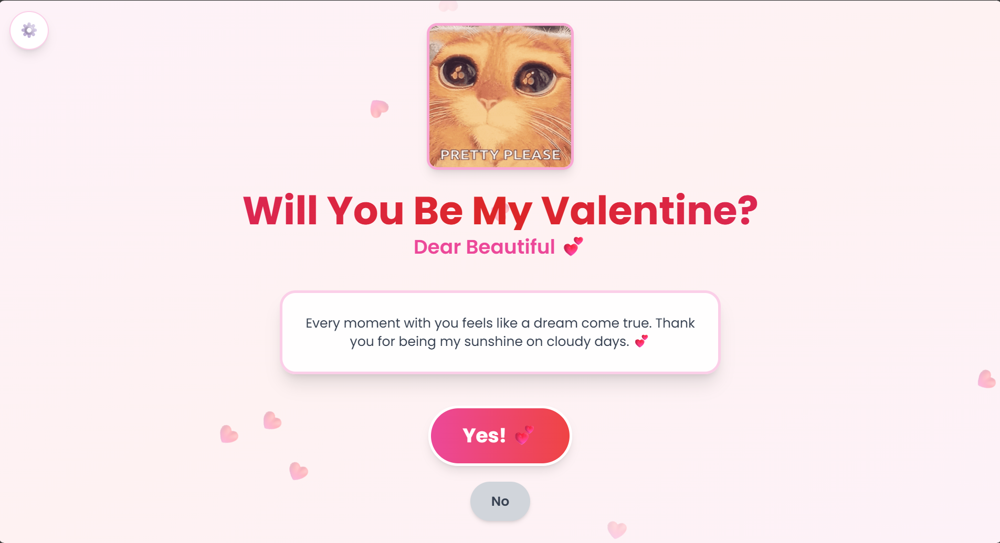

# 💖 Valentine's Day Web Application

A beautifully designed, interactive **"Will You Be My Valentine?"** web application built using modern frontend technologies. This project features playful UI interactions, romantic animations, and customizable messages to create a memorable digital Valentine experience.

---

## 🌐 Live Demo
https://valentines-card-gamma.vercel.app/

---

## 📸 Preview


---

## 🚀 Features

### ✨ Interactive Experience
- Animated **"Yes 💖"** button with celebration effects
- Playful **"No 😢"** button that moves when hovered
- Floating heart background animation
- Confetti celebration effect
- Heart burst success animation

---

### 🎨 Modern UI & Design
- Romantic pastel color palette
- Fully responsive design (mobile & desktop)
- Smooth transitions and micro-interactions
- Elegant typography using Google Fonts

---

### 🎵 Personalization Features
- Customizable girlfriend's name
- Personalized romantic messages
- Background music toggle
- Settings panel for easy customization

---

## 🛠️ Tech Stack

| Technology | Purpose |
|------------|------------|
| React 18 | UI Development |
| Vite | Fast Development & Build Tool |
| Tailwind CSS | Styling Framework |
| JavaScript (ES6+) | Application Logic |

---

## 📂 Project Structure

```
valentine-app/
├── src/
│   ├── components/
│   │   ├── FloatingHearts.jsx
│   │   ├── MessageDisplay.jsx
│   │   ├── ValentineButtons.jsx
│   │   ├── SuccessAnimation.jsx
│   │   └── Customization.jsx
│   ├── App.jsx
│   ├── main.jsx
│   └── index.css
├── index.html
├── package.json
├── vite.config.js
├── tailwind.config.js
└── postcss.config.cjs
```

---

## ⚙️ Installation & Setup

### 1️⃣ Clone the Repository
```bash
git clone https://github.com/yourusername/valentine-app.git
cd valentine-app
```

---

### 2️⃣ Install Dependencies
```bash
npm install
```

---

### 3️⃣ Run Development Server
```bash
npm run dev
```

Application runs at:
```
http://localhost:5173
```

---

### 4️⃣ Build for Production
```bash
npm run build
```

---

### 5️⃣ Preview Production Build
```bash
npm run preview
```

---

## 🎮 How To Use

### Customize Your Message
1. Click the ⚙️ settings icon  
2. Enter her name  
3. Add your personalized message  
4. Close settings panel  

---

### Interactive Actions
- Click **Yes 💖** → Displays celebration animation  
- Hover **No 😢** → Button moves away playfully  
- Toggle 🎵 → Turn background music on/off  
- Click **Let's Start Again 💫** → Reset the app  

---

## 🎨 Customization Guide

### Change Theme Colors
Edit inside:

```
tailwind.config.js
```

```js
valentine-light: #ffe0e6
valentine-pink: #ff69b4
valentine-red: #ff1744
valentine-dark: #c2185b
```

---

### Modify Fonts
- **Dancing Script** → Romantic headings  
- **Poppins** → Body text and UI elements  

---

### Available Animations
Located in `index.css`:

- float  
- bounce-gentle  
- heartbeat  
- wiggle  

---

## 📱 Browser Compatibility

✔ Chrome / Edge  
✔ Firefox  
✔ Safari  
✔ Mobile Browsers  

---

## 🧠 Learning Objectives

This project demonstrates:

- React component architecture  
- State management  
- UI/UX animation techniques  
- Tailwind CSS styling  
- Responsive design  
- User interaction handling  

---

## 🗺️ Future Improvements

- 💌 Save messages using database storage  
- 🔊 Add multiple music selections  
- 🌐 Shareable Valentine link generation  
- 🎥 Add animated GIF / video backgrounds  
- 📨 Send confirmation email feature  

---

## 🤝 Contributing

Contributions, feature suggestions, and improvements are welcome.

1. Fork the project  
2. Create a feature branch  
3. Commit your changes  
4. Submit a pull request  

---

## 📜 License

This project is open for personal and educational use.

---

⭐ If you like this project, feel free to star the repository!
